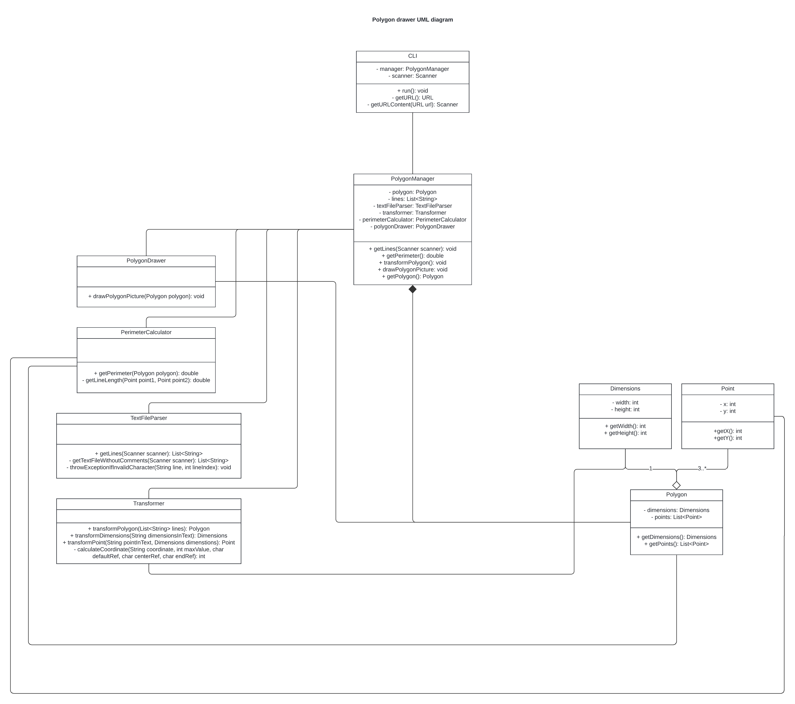

# Aplikace pro vykreslování polygonů
### Popis
* Tato aplikace je navržena pro vykreslování polygonů na základě dat získaných z textového souboru, který se získá ze zadané URL.
* Aplikace obsahuje následující komponenty:
  * __Polygon__ - Třída rerezentující polygon. Je definována rozměry (šířka x výška) a seznamem jednotlivých bodů.
  * __Point__ - Třída reprezentující jednotlivý bod. Obsahuje celočíselné souřadnice __x__ a __y__.
  * __Dimensions__ - Třída reprezentující velikost polygonu. Jejími parametry jsou celočíselná výška a šířka. Také obsahbuje validaci pro zajištění, aby velikost neměla záporné hodnoty nebo 0.  
  * __TextFileParser__ - Služba, která se stará o načtení textového souboru, odstranění komentářů a validaci charakterů.  Vrací list textových řetězců, které reprezentují jednotlivé řádky souboru.
  * __Transformer__ - Služba, která zajišťuje transformaci objektů Polygon, Dimensions a Point z textových řádků. Krom metod pro transformace objektů obsahuje také soukromou metodu pro výpočet souřadnice x a y pro jednotlivé body polygonu.
  * __PerimeterCalculator__ - Služba, která poskytuje metodu pro výpočet obvodu polygonu __getPerimeter__. Metoda také obsahuje soukromou metodu getLineLength, která podle rovnice výpočítá vzdálenost dvou specifikovaných bodů.
  * __PolygonDrawer__ - Služba, která se stará o vykreslení polygonu do obrázku formátu PNG. Obrázek uloží do složky output.  

* Aplikace dále obsahuje fasádu PolygonManager, která poskytuje propojení mezi UI a funkčností aplikace.
* UI je zpracováno v dvou podobách - CLI a GUI (javaFx)

### Postup spuštění a ovládání
#### GUI - Postup spuštění
* Jelikož je GUI vytvořené pomocí JavaFx, je potřeba stáhnout knihovnu. Tu získáte např. ze stránky https://gluonhq.com/products/javafx/
* Stáhněte __SDK__ pro svůj operační systém verze __21.0.3__ a soubor extrahujte.
* Poté klikněte na nastavení souboru a vyberte __Project Structure__ (nebo použijte klávesovou zkratku Crtl+Alt+Shift+S)
* V Project Structure vyberte Libraries a přidejte novou knihovnu Java. Jako souborovou cestu knihovny zadejte cestu k vašemu extrahovanému SDK a vyberte složku lib.  __Příklad souborové cesty__ - "C:\openjfx-21.0.3_windows-x64_bin-sdk\javafx-sdk-21.0.3\lib"
* Poté klikněte na __Run__ - __Edit Configurations__ vyberte aplikaci MainGUI a udělejte následující: 
  * Pokud nastavení Build and run obsahuje VM option s tímto textem:  --module-path "C:\openjfx-21.0.3_windows-x64_bin-sdk\javafx-sdk-21.0.3\lib" --add-modules javafx.controls,javafx.fxml --add-exports javafx.graphics/com.sun.javafx.util=ALL-UNNAMED upravte pouze souborovou cestu podle své cesty k složce lib ve staženém SDK.
  * Pokud nastavení neobsahuje výše specifikovanou VM option, přidejte ji pomocí klávesové zkratky __Alt+V__. Nezapomeňte změnit souborovou cestu a __ujistěte se, že je cesta v uvozovkách__.
  * Nakonec klikněte na __Build - Rebuild Project__
#### GUI - Ovládání
* Po spuštění aplikace uvidíte textové pole pro zadání URL stránky s daty pro vykreslení polygonu, pod textovým polem se nachází plocha, kde se vykreslí polygon.
 Na spodu aplikace jsou v levém rohu 2 tlačítka pro vykreslení polygonu a smazání nákresu a specifikované URL. Uprostřed se nachází text s hodnotou obvodu polygonu.
 V pravém rohu je tlačítko pro export polygonu do PNG. Po kliknutí najdete obrázek polygonu ve složce output.
#### CLI - Ovládání
* Po spuštění CLI aplikace butete vyzváni k zadání URL adresy s daty pro vykreslení polygonu.
 Po zadání se vypočítá obvod a exportuje se obrázek polygonu do složky output.

### Vizuální zobrazení struktury aplikace pomocí UML Class Diagramu

